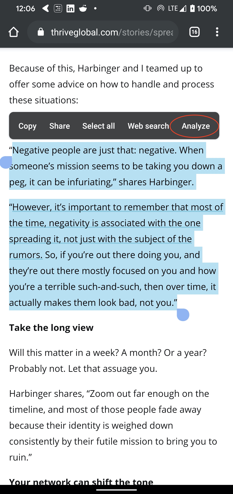
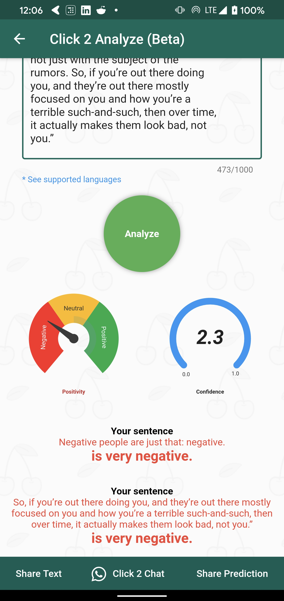

# Click2Analyze #AndroidDevChallenge

 

## Android Developer Challenge: helpful innovation, powered by On-Device Machine Learning + you!

### Tell us what your idea is. 
The idea is to create an app that can help people analyzing the text/message and fixing the anomaly of the message that deviates from what is standard, normal, or expected. It will also guide them towards how to make it more positive for the betterment of society using NLP and ML.
This can be helpful for anyone and can play a major role especially for bloggers, influencers and official mails, etc. There are many use-cases where it can be used including day to day conversations.
There are two parts. The first one which I have already implemented is used by thousands of users now is let's say
Eg - “You need to learn at least one new programming language every year”.
It is a very negative statement. Using NLP I could implement an algorithm depending upon the API response that which statement is negative. And then after the improvisation, it can be improved with something like - “Learning a new programming language is a great way to acquire new insights”.
The second part of the idea is using On Device ML to suggest to them can they improve their statements like the anomaly keywords or even full phrases. The whole thing doesn’t need to be inside the app only but also can be shown to the user using a floating text selection toolbar and then the results on an overlay popup. It still needs to be implemented.

### Tell us how you plan on bringing it to life.
1) I have already implemented the first phase of the app where you can either open the app and type/paste your text and you can analyze it for the level of negative/positivity and it also filters your negative statements depending on your score and magnitude or you can also just select any text in any app and then you can use analyze action in the floating text selection toolbar to easily access it. The APK and some screenshots are attached to the repository and the code is a part of a private repo as of now ( I can give access to it and can also make it open source if needed). It’s also available for testing as a part of my Click2Chat app
-h​ ttps://play.google.com/store/apps/details?id=com.mtechviral.clicktochat
2) I can use Google's help in implementing the second phase where I need Google's guidance to implement the On-Device Machine Learning using Tensorflow Lite or MLKit by which I can give suggestions to the users that how can they improve their statements like the anomaly keywords or even full phrases. Right now I can only show them which statement is negative but I want to show them suggestions based on machine learning which will improve by time. Also, I want Google’s mentorship to learn how can I train my model more using this data submitted to the app/tool.
   
3) The planned timeline is -
    #### (Nov 2019 - Dec 2019) - 1st phase implementation and giving it to the users to get the feedback.
    #### (Jan 2020 - Feb 2020) - Implementing the 2nd phase using Google's help and support to implement machine learning-based suggestions and also researching more use cases around this.
    #### (Mar 2020) - Giving the beta to the users and getting more feedbacks and doing more testing.
    #### (Apr 2020) - Working on the feedbacks and doing the final release.

## Some Existing Implementation

### Tell us about you. 
I'm Pawan Kumar. I am a Google Developer Expert for Flutter, Firebase, Dart and Web Tech. I work in a company called Flick2Know Technologies. I am also a part-time YouTuber running a channel "MTECHVIRAL" where I publish tech tutorials and also contribute regularly to open source. I recently built an open-source project "Devfest App" which is a template app for DevFest and being used by several GDGs around the globe. I have made many successful apps available on the Google Play Store and the App Store. I also worked on an MVP for the CNS Equipment Tracking app for Airport Authority of India during Smart India Hackathon.
Some Projects & Links -
1) Click2Chat - ​Click2Chat allows you to translate into 70 languages. Analyze messages and spread positivity. Send, schedule the message to your unsaved contact numbers and clean Favourite Messenger's message & Download stories. Link - https://play.google.com/store/apps/details?id=com.mtechviral.clicktochat
2) ReadyO - ​ReadyO offers the next-generation radio user experience with a beautiful user interface. It has the top radio channels with music facts and exclusive podcasts which updates frequently. It also comes with a dark mode. Link - https://play.google.com/store/apps/details?id=mtechviral.readyo
3) CNS - RTM - Real-Time​ Monitoring of CNS Equipment Spares. Project For Smart India Hackathon 2017 for Airport Authority of India. Link - https://github.com/iampawan/CNS-RTM
4) Flutter Example Apps - A collection of the open-source stuff I created with their youtube tutorials. Having 7.7k stars and 1.5k forks. Link - https://github.com/iampawan/FlutterExampleApps
5) Github Link - ​https://github.com/iampawan/
6) Youtube Link - ​https://youtube.com/mtechviral​ (42K Subscribers)

